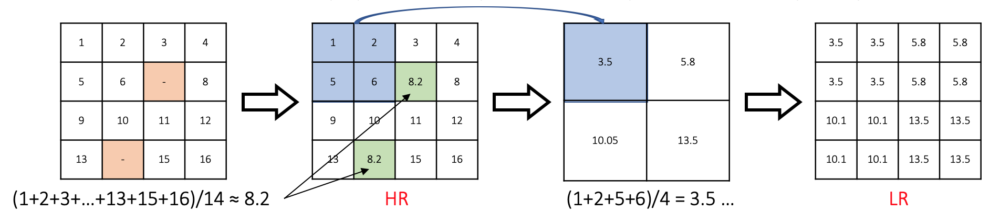
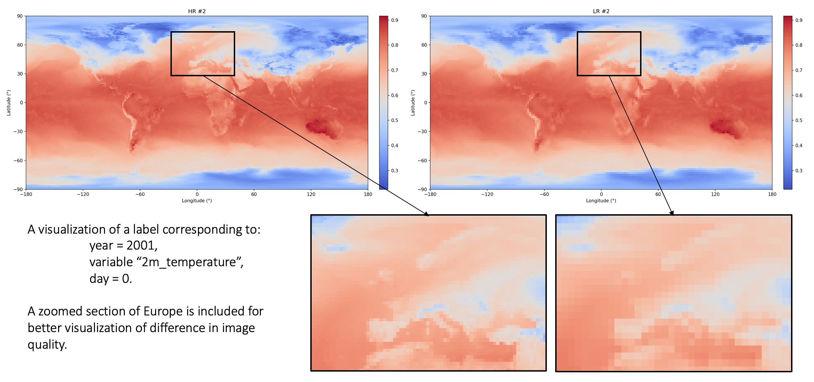
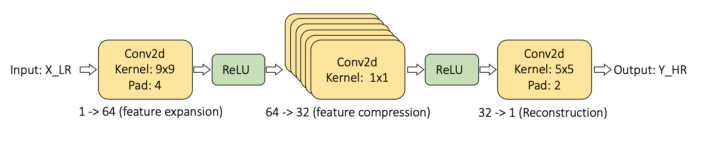
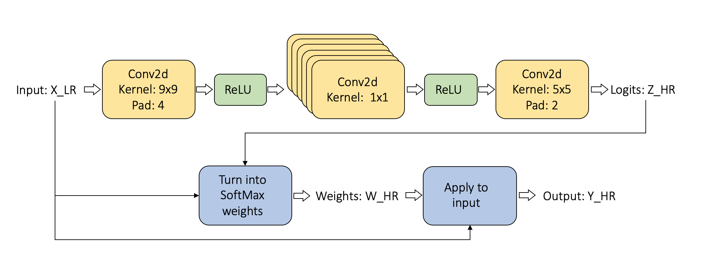
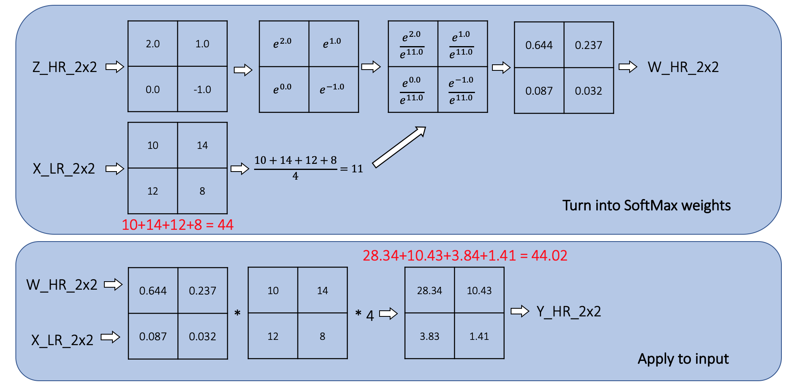
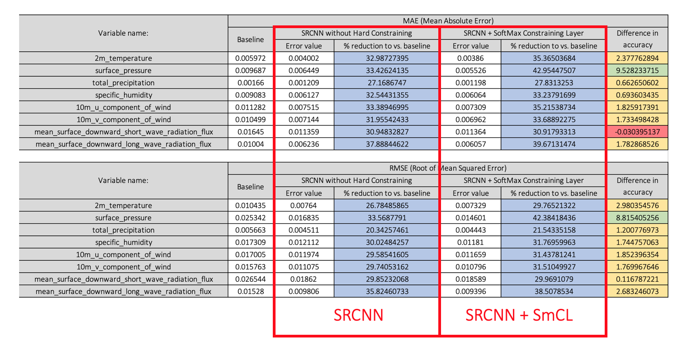

## 0. Hard Constrained Downscaling using SoftMax Function

Compares two neural approaches to **spatial downscaling** of gridded climate fields: a standard SRCNN and an SRCNN augmented with a **SoftMax Constraining Layer (SmCL)** that enforces a hard local conservation constraint on each 2×2 block.

Reference paper: *"Hard-Constrained Deep Learning for Climate Downscaling"* — Paula Harder et al.

---

## 1. Repository Structure

HCDS/
├─ runs/
│  ├─ SRCNN_2m_temperature/                                ← Checkpoints, loss curves, example maps
│  └─ SRCNN_SmCL_2m_temperature/                           ← Checkpoints, loss curves, example maps
├─ ranges.py                                               ← Per-variable min/max utilities
├─ raw_to_labels.ipynb                                     ← Convert NetCDF → NPZ dataset
├─ example_label.ipynb                                     ← Visualise HR vs LR inputs
├─ SRCNN.ipynb                                             ← Train + evaluate unconstrained SRCNN
├─ SRCNN_SmCL.ipynb                                        ← Train + evaluate SRCNN + SmCL
└─ README.md                                               ← Info

---

## 2. Approach

The pipeline works with ERA5-like **NetCDF (`.nc`)** files (daily global grids, e.g. 180×360) and converts them into paired **(LR input, HR target)** samples for supervised training.

**Data preparation:** Each yearly `.nc` file is converted to `.npz`. Low-resolution inputs are constructed by taking the mean of each 2×2 block then repeating each value back to HR size — producing a blocky upsampled field. The task is then: *given this LR-expanded field, reconstruct the original HR field.* All fields are min-max normalised to [0, 1] per variable.

**Model — SRCNN:** A 3-layer convolutional network standard in super-resolution:

| Layer | Kernel | Channels | Activation |
|-------|--------|----------|------------|
| Conv2d | 9×9, pad 4 | 1 → 64 | ReLU |
| Conv2d | 1×1 | 64 → 32 | ReLU |
| Conv2d | 5×5, pad 2 | 32 → 1 | — |

**Model — SRCNN + SmCL:** The same CNN, but its output is treated as logits rather than a direct prediction. A SoftMax Constraining Layer converts those logits into per-block weights (summing to 1 within each 2×2 block), which are applied to the corresponding LR values to produce the final HR output. This forces each predicted patch to be a convex reweighting of the LR input — a hard local constraint that prevents physically implausible reconstructions.

**Validation:** 80% train / 10% val / 10% test split. Baseline metrics are computed using the LR-expanded input as a naive prediction.

---

## 3. Notebooks

### `raw_to_labels.ipynb`
Converts `.nc` files in `./input_raw/` into training-ready `.npz` pairs in `./input_labels/`. Handles masked values (masked → NaN → filled with mean of valid pixels), casts to `float32`, builds LR-expanded inputs, and computes global per-variable `vmin`/`vmax` for normalisation.

Each `.npz` contains:

| Key | Description |
|-----|-------------|
| `X` | LR-expanded input image, normalised to [0, 1] |
| `Y` | HR target image, normalised to [0, 1] |
| `norm` | Normalisation name (`"zero_one"`) |
| `vmin`, `vmax` | Per-variable bounds for inverse transform |



### `example_label.ipynb`
Loads a single `(year, variable, day)` from `./input_raw/`, builds the LR-expanded input, and plots HR vs LR side-by-side for visual sanity-checking. Applies longitude roll and vertical flip for a north-up map orientation.



### `SRCNN.ipynb`
Trains and evaluates the unconstrained SRCNN. Supports configurable `YEARS` and `VARIABLES`, optional patch sampling to increase effective dataset size, and saves model checkpoints, loss curves, and example prediction maps to `./runs/<run_name>/`.



### `SRCNN_SmCL.ipynb`
Identical setup to `SRCNN.ipynb` but with the SoftMax Constraining Layer applied at the final stage. The CNN produces logits; SmCL converts them to block-wise SoftMax weights, which are multiplied against the LR input to yield the constrained HR prediction.





---

## 4. Results

Both SRCNN variants substantially outperform the LR-expanded baseline across all variables, confirming the models learn meaningful spatial structure. Adding SmCL further reduces MAE and RMSE for most variables.

| Model | vs. Baseline |
|-------|-------------|
| SRCNN | Large improvement across all variables |
| SRCNN + SmCL | Additional MAE/RMSE reduction over plain SRCNN |



The largest gains from SmCL appear in smooth, physically coherent fields — surface pressure, 2m temperature, 10m wind components, and longwave radiation. These benefit most because SmCL's convex-combination constraint preserves realistic spatial patterns while suppressing reconstruction artifacts.

> Note: errors in result tables are in normalised units. To recover physical units, apply the inverse min-max transform using each variable's `vmin`/`vmax`.

Comparison with Harder et al. (2024): their constrained super-resolution experiments focus on total column water at increasing task difficulties (4× spatial SR; multi-step temporal; joint spatial+temporal). Our improvements from SmCL are consistent in direction and comparable in magnitude to those reported for their TCW settings, suggesting the benefits of hard output constraining generalise across variables and task types.

---

## 5. Workflow

```
./input_raw/          ← Place yearly .nc files here
       ↓  raw_to_labels.ipynb
./input_labels/       ← Generated .npz pairs
       ↓  SRCNN.ipynb or SRCNN_SmCL.ipynb
./runs/<run_name>/    ← Checkpoints, curves, maps
```